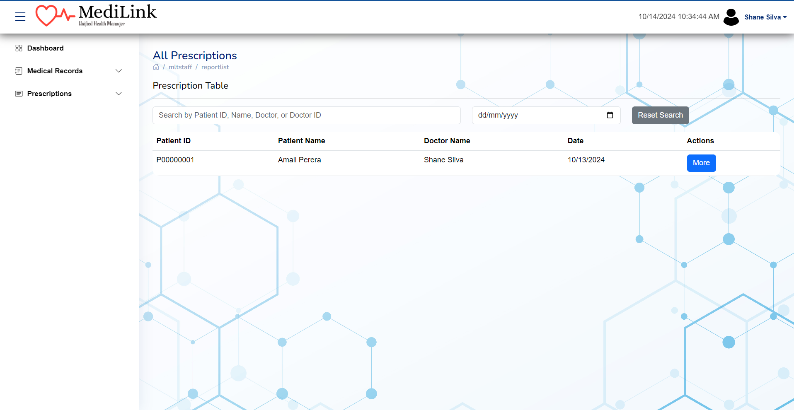

# MediLink - Healthcare Management System

## Overview

MediLink is a comprehensive healthcare management system designed to streamline the operations of hospitals, clinics, and other medical facilities. The system is built using the **MERN stack** (MongoDB, Express, React, Node.js) and is designed to manage patient records, appointments, billing, and payments efficiently.

The goal of MediLink is to enhance the management and automation of hospital operations, providing a user-friendly interface for healthcare professionals and ensuring smooth interaction with patients through online services such as payment management and email notifications.

## Key Features

- **Patient Management**: Manage patient records, appointments, and history.
- **Doctor and Staff Management**: Handle scheduling and staff profiles.
- **Payment and Billing**: Automated billing, payment processing, and receipt generation.
- **Health Facility Locator** : Locate Nearest Health Facilities

## Web Application

The **MediLink web application** is developed using the **MERN stack**:
- **Frontend**: React.js
- **Backend**: Node.js and Express.js
- **Database**: MongoDB

## 🚀 My Contribution

I contributed to the **Health Record Management module** of the MediLink system, focusing on the following key responsibilities:

- **Account and Permissions Management for Medical Staff**: 
  - Managed user accounts for doctors, nurses, laboratory technicians, and radiologists.
  - Ensured appropriate permissions and authorizations for relevant features.

- **Medical Records Management**: 
  - Developed the medical records manager, enabling medical staff to create, update, and manage patient medical records.
  - Seamlessly integrated medical records with patients' digital health cards.

- **Medical Reports Management**: 
  - Implemented the medical reports manager, allowing MLT (Medical Laboratory Technicians) staff to generate laboratory and radiology reports for patients.
  - Linked these reports to patients' digital health cards.

- **Prescription Management**: 
  - Designed and built the prescription manager, enabling efficient storage and management of patient prescriptions.
  - Facilitated communication between medical staff and patients regarding prescriptions.

- **Patient Management and Digital Health Card Integration**: 
  - Developed the patient account manager, including the creation of digital health cards.
  - Enabled medical staff to quickly access a patient's comprehensive medical summary by entering their patient number in the system.

## Installation Guide

Follow the steps below to clone the repository, set up the development environment, and run the application locally:

1. **Clone the Repository**
   ```bash
   git clone https://github.com/rachcha2002/medilink.git
   cd medilink
2. **Install Dependencies and Run**
   ```bash
   cd medilinkbackend --> npm install --> npm start
   cd medilinkpatientapp --> npm install --> npm start
   cd medilinkstaffapp --> npm install --> npm start

## Some of UI
  
Below are screenshots of the MediLink application for better visualization:

### Add Prescription Screen


### All Prescriptions Screen


### All Reports Screen


### Medical Records Overview Screen


### Medical Records Screen


### Patient Checker Screen


### Prescriptions Screen


### Screenshot (2024-10-14 10:21:19)


### Screenshot (2024-10-14 10:23:07)


